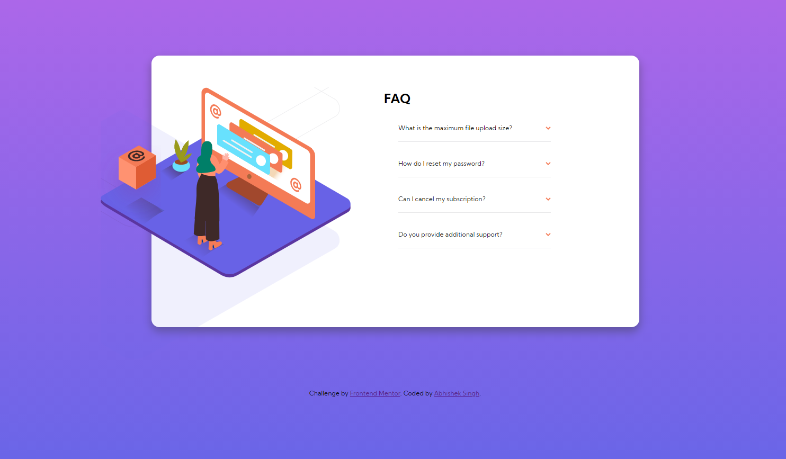
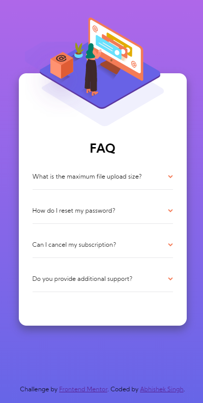

# Frontend Mentor - FAQ accordion card solution

This is a solution to the [FAQ accordion card challenge on Frontend Mentor](https://www.frontendmentor.io/challenges/faq-accordion-card-XlyjD0Oam). Frontend Mentor challenges help you improve your coding skills by building realistic projects. 

## Table of contents

- [Overview](#overview)
  - [The challenge](#the-challenge)
  - [Screenshot](#screenshot)
  - [Links](#links)
- [My process](#my-process)
  - [Built with](#built-with)
  - [What I learned](#what-i-learned)
  - [Continued development](#continued-development)
  - [Useful resources](#useful-resources)
- [Author](#author)


## Overview

### The challenge

Users should be able to:

- View the optimal layout for the component depending on their device's screen size
- See hover states for all interactive elements on the page
- Hide/Show the answer to a question when the question is clicked

### Screenshot

-Desktop



-Mobile




### Links

- Solution URL: [Add solution URL here](https://your-solution-url.com)
- Live Site URL: [Add live site URL here](https://your-live-site-url.com)

## My process

### Built with

- Semantic HTML5 markup
- CSS custom properties
- Flexbox
- Mobile-first workflow
- detail-summary tag in HTML


### What I learned

This project was a great learning experience. Following are the things that I have learned through the project:
- detail-summary tag: This tag gives the functionality of hidden dropdown menu weithout the use of JS in  your project. The section is rendered by browser itself. 
```html
 <details>
  <summary>What is the maximum file upload size?</summary>
  <p>No more than 2GB. All files in your account must fit your allotted storage space.</p>
</details>
```

Also, customizing the dropdown image in css .
```css
.faq-section details[open] summary::after {
  -webkit-transform: rotate(180deg);
          transform: rotate(180deg);
}
}
```
- position: absolte: This property was very useful in this project to move around the object with respect to a base object. This would surely help me with designing the pages better without hindering the margin and padding.

- Animating the transition was another attribute that ws introduced in this project. There is still a lot of functionality that needs to be checked.
To see how you can add code snippets, see below:


### Continued development

1. Animating the content and trasition is somthing that I need to study and use better in future projects
2. Positioning the elements on the page and make them responsive.


### Useful resources

- [Kevin powell](https://www.youtube.com/kepowob) - This channel has being pure gold in content related to css/HTML. It has helped me to visualize the css properties so that I can use them better in my projects. 

## Author

- Frontend Mentor - [@abhisheksingh7](https://www.frontendmentor.io/profile/abhisheksinghwork7)


